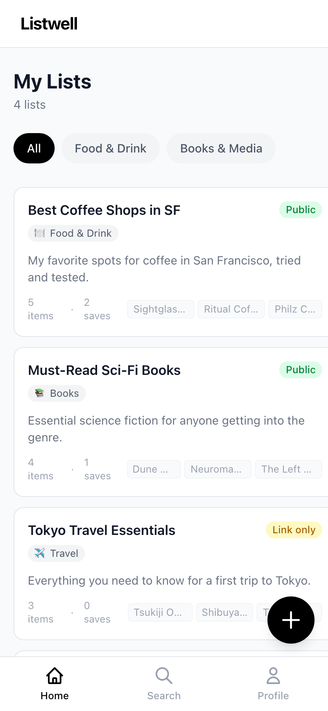
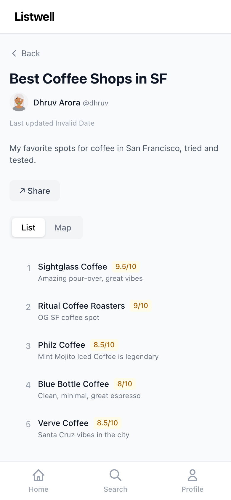
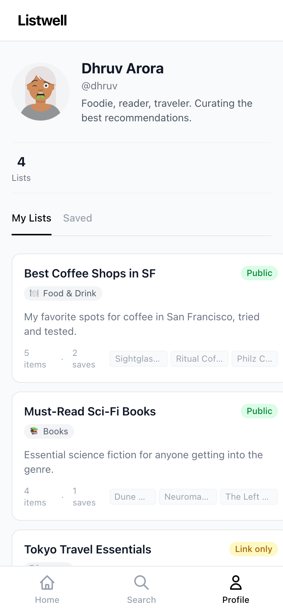
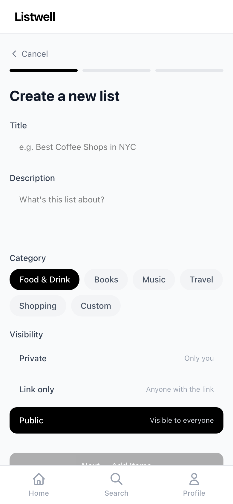
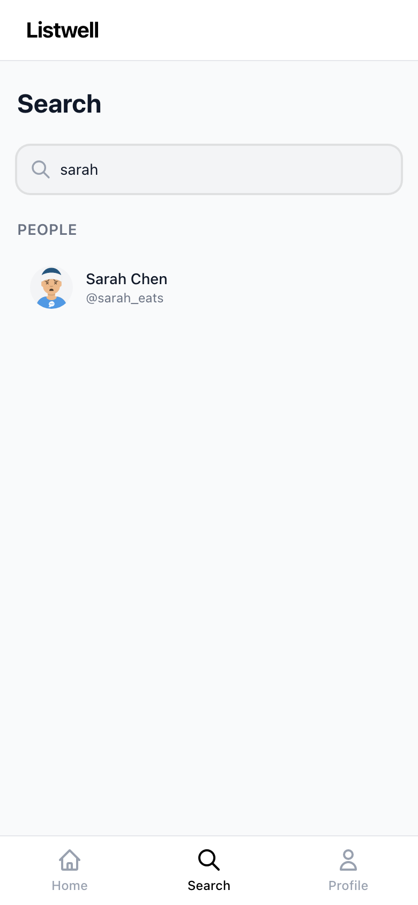
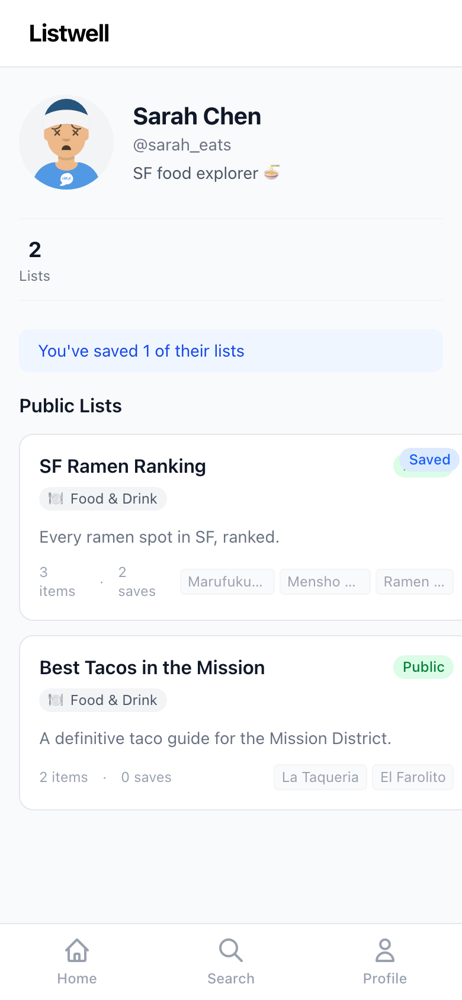
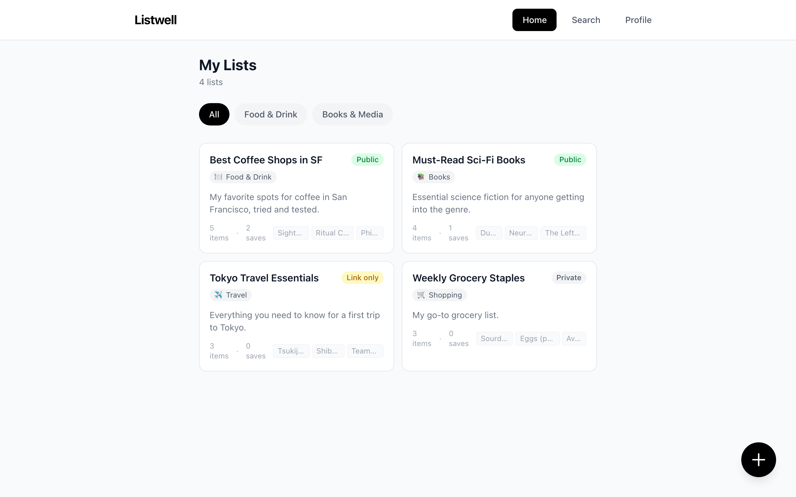

# 📋 Listwell

**Curate and share recommendation lists about anything** — restaurants, books, music, travel spots, and more.

Listwell is a mobile-first web app where you create ordered lists of recommendations, share them with friends, and remix others' lists to make them your own.

<p align="center">
  
  &nbsp;&nbsp;
  
  &nbsp;&nbsp;
  
</p>

---

## ✨ Features

### 📝 Create Lists
Build ordered recommendation lists with titles, descriptions, categories, and visibility controls. Add items with names, personal notes, and ratings (0–10). A 3-step creation wizard makes it easy.

<p align="center">
  
</p>

### 🔍 Search & Discover
Find lists and people by name, handle, or category. Tap into someone's profile to browse their public lists.

<p align="center">
  
  &nbsp;&nbsp;
  
</p>

### 💾 Save & Remix
- **Save** other people's lists as read-only bookmarks
- **Remix** a list to fork it — pick which items to keep, add your own, and get a new list with attribution to the original creator

### 📍 Place-Based Items
Items can carry latitude/longitude for map views — perfect for restaurant guides, travel itineraries, and city recommendations.

### 🔒 Three-Tier Visibility
- **Private** — only you can see it
- **Link only** — anyone with the URL
- **Public** — discoverable by everyone

### 📱 Mobile-First, Desktop-Ready
Designed for phones with a bottom tab bar, but fully responsive on desktop with a top navigation bar.

<p align="center">
  
</p>

---

## 🛠 Tech Stack

| Layer | Tech |
|-------|------|
| **Frontend** | [SolidJS](https://www.solidjs.com/) + [Solid Router](https://github.com/solidjs/solid-router) |
| **Styling** | [Tailwind CSS](https://tailwindcss.com/) v4 |
| **Backend** | [PocketBase](https://pocketbase.io/) (SQLite-powered) |
| **Build** | [Vite](https://vitejs.dev/) |

---

## 🚀 Getting Started

### Prerequisites

- [Node.js](https://nodejs.org/) 18+
- [PocketBase](https://pocketbase.io/docs/) binary

### 1. Clone & Install

```bash
git clone git@github.com:dhruvarora93/ListIt.git
cd ListIt
npm install
```

### 2. Start PocketBase

Download [PocketBase](https://pocketbase.io/docs/), then:

```bash
./pocketbase serve
```

Create a superuser account at `http://127.0.0.1:8090/_/` when prompted.

### 3. Set Up Database

Update the admin credentials in `scripts/setup-pb.py`, then run:

```bash
python3 scripts/setup-pb.py    # Creates collections & schema
python3 scripts/reseed.py      # Seeds sample data
```

### 4. Start the App

```bash
npm run dev
```

Open **http://localhost:3000** — you're in! 🎉

---

## 📁 Project Structure

```
src/
├── index.tsx              # Entry point & route definitions
├── app.tsx                # App shell (nav bars + layout)
├── index.css              # Global styles + Tailwind
├── store/
│   └── data.ts            # PocketBase client & all API functions
├── components/
│   ├── BottomNav.tsx       # Mobile bottom tab bar
│   ├── DesktopNav.tsx      # Desktop top navigation
│   ├── ListCard.tsx        # List preview card component
│   └── ShareSheet.tsx      # Bottom sheet for sharing
├── pages/
│   ├── Home.tsx            # Home feed with filter tabs
│   ├── Search.tsx          # Search lists & users
│   ├── Profile.tsx         # Current user profile
│   ├── UserProfile.tsx     # Other user's public profile
│   ├── ListDetail.tsx      # Full list view with items
│   ├── CreateList.tsx      # 3-step list creation wizard
│   └── RemixList.tsx       # Remix flow with item selection
└── errors/
    └── 404.tsx             # Not found page

scripts/
├── setup-pb.py             # Creates PocketBase collections
├── reseed.py               # Seeds sample data
└── screenshots.mjs         # Captures app screenshots
```

---

## 📊 Data Model

| Collection | Key Fields |
|-----------|------------|
| **profiles** | `handle` (unique), `display_name`, `bio`, `avatar_url` |
| **lists** | `owner` → profiles, `title`, `description`, `category`, `visibility`, `slug`, `allow_save`, `allow_remix`, `remixed_from` → lists |
| **items** | `list` → lists, `name`, `note`, `rating` (0–10), `position`, `latitude`, `longitude` |
| **saves** | `user` → profiles, `list` → lists (unique pair) |

---

## 🗺 Roadmap

- [ ] Authentication (email/password + OAuth)
- [ ] Real map view with Mapbox/Leaflet for place-based items
- [ ] Drag-and-drop item reordering
- [ ] Image uploads for list covers
- [ ] Discover/explore tab with trending lists
- [ ] PWA service worker for offline support
- [ ] Push notifications for saves on your lists
- [ ] Deploy to Fly.io / Railway

---

## 📄 License

MIT
